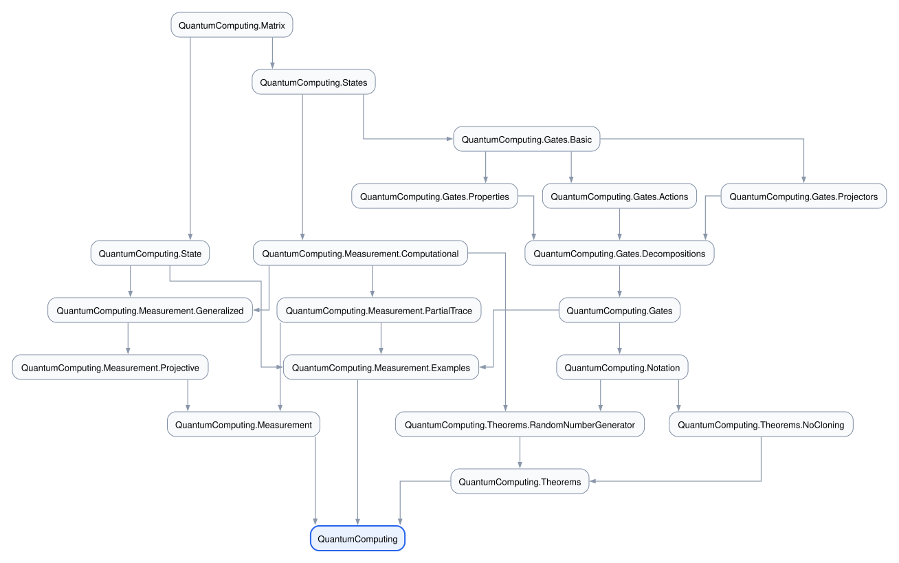

# Quantum Computing in Lean

A Lean 4 formalization of basic quantum computing definitions.

It is a Lake/mathlib4 project and starts with a small core API for finite-dimensional
complex matrices, state vectors, common qubit states and one-, two-, and
three-qubit gates, scoped quantum notation, projections, and measurement
probabilities.

## Highlights

- Thin wrappers and helper lemmas over finite-dimensional complex matrices and
  vectors, including notation, normalization, and unitarity facts.
- Named one- and two-qubit states, one-, two-, and three-qubit gates, and
  projectors, with verified gate actions and standard decomposition identities.
- Scoped Dirac ket notation and common gate aliases.
- Computational, generalized, projective, and partial-trace measurement APIs.
- Formalized examples including Hadamard-based uniform random-number generation
  and variations of the no-cloning theorem.

## Layout

The diagram below shows the public module structure at a glance. The text list
that follows keeps the individual files easy to scan.



### Core

- [`QuantumComputing/Matrix.lean`](QuantumComputing/Matrix.lean): thin wrappers
  and helper lemmas over mathlib matrices and vectors, including adjoints,
  projections, traces, and Kronecker products.
- [`QuantumComputing/States.lean`](QuantumComputing/States.lean): named qubit
  states, including basis states and Bell states.
- [`QuantumComputing/State.lean`](QuantumComputing/State.lean): pure-state and
  density-matrix wrappers.
- [`QuantumComputing/Notation.lean`](QuantumComputing/Notation.lean): scoped
  Dirac ket notation, scalar notation, and gate aliases.

### Gates

- [`QuantumComputing/Gates.lean`](QuantumComputing/Gates.lean): public gate
  entry point.
- [`QuantumComputing/Gates/Basic.lean`](QuantumComputing/Gates/Basic.lean): named
  gates such as `X`, `H`, `CNOT`, `CZ`, `SWAP`, and `TOFFOLI`.
- [`QuantumComputing/Gates/Projectors.lean`](QuantumComputing/Gates/Projectors.lean):
  named projectors such as `P0`, `P1`, `PPlus`, and `PMinus`.
- [`QuantumComputing/Gates/Properties.lean`](QuantumComputing/Gates/Properties.lean):
  unitarity, adjoint, and involution facts for named gates.
- [`QuantumComputing/Gates/Actions.lean`](QuantumComputing/Gates/Actions.lean):
  gate actions on named states.
- [`QuantumComputing/Gates/Decompositions.lean`](QuantumComputing/Gates/Decompositions.lean):
  standard gate decomposition identities.

### Measurement

- [`QuantumComputing/Measurement.lean`](QuantumComputing/Measurement.lean):
  public measurement entry point.
- [`QuantumComputing/Measurement/Computational.lean`](QuantumComputing/Measurement/Computational.lean):
  computational-basis measurement definitions and probability facts.
- [`QuantumComputing/Measurement/Generalized.lean`](QuantumComputing/Measurement/Generalized.lean):
  generalized measurements and typed operators.
- [`QuantumComputing/Measurement/Projective.lean`](QuantumComputing/Measurement/Projective.lean):
  projective measurements and the bridge to generalized measurements.
- [`QuantumComputing/Measurement/PartialTrace.lean`](QuantumComputing/Measurement/PartialTrace.lean):
  partial trace and partial measurement probability facts.
- [`QuantumComputing/Measurement/Examples.lean`](QuantumComputing/Measurement/Examples.lean):
  concrete examples for named states.

### Theorems

- [`QuantumComputing/Theorems.lean`](QuantumComputing/Theorems.lean): public
  theorem entry point.
- [`QuantumComputing/Theorems/RandomNumberGenerator.lean`](QuantumComputing/Theorems/RandomNumberGenerator.lean):
  Hadamard-based random-number generation.
- [`QuantumComputing/Theorems/NoCloning.lean`](QuantumComputing/Theorems/NoCloning.lean):
  no-cloning results.

## Requirements

This project is pinned to Lean `v4.29.1` and mathlib4 `v4.29.1`. Lake reads the
Lean version from `lean-toolchain` and the mathlib dependency from
`lakefile.lean`.

## Build

```sh
lake exe cache get
lake build
```

## Formatting

LeanFmt is included as a Lake dependency. Use either of these commands to format the Lean
sources:

```sh
make fmt
# or
lake exe fmt --recursive .
```

## Using the Library

The top-level module imports the public quantum computing API:

```lean
import QuantumComputing

#check QuantumComputing.ketPlus
#check QuantumComputing.H
#check QuantumComputing.Theorems.NoCloning.no_cloning_1
```

Scoped Dirac ket notation, scalar notation, and gate aliases are available as an
opt-in surface:

```lean
import QuantumComputing

open scoped QuantumComputing

#check |+⟩
#check |0⟩⊗[3]
#check √2⁻¹
#check QuantumComputing.CX
#check QuantumComputing.CCX
```

You can also import focused modules when working on a smaller part of the
library:

```lean
import QuantumComputing.Gates
import QuantumComputing.Notation
import QuantumComputing.Measurement
import QuantumComputing.Theorems.NoCloning
```

## Editor Notes

VS Code's Lean extension treats `⟨` and `⟩` as bracket pairs. Dirac ket notation
such as `|+⟩` intentionally has a closing `⟩` without a matching `⟨`, so VS Code
may color the `⟩` as an unmatched bracket even though Lean accepts the file.

To avoid that false editor warning, override Lean's workspace bracket list and
omit the `["⟨", "⟩"]` pair. A compact `.vscode/settings.json` workaround is:

```json
{
  "[lean4]": {
    "editor.language.brackets": [
      ["(", ")"],
      ["`(", ")"],
      ["``(", ")"],
      ["[", "]"],
      ["#[", "]"],
      ["@[", "]"],
      ["%[", "]"],
      ["{", "}"]
    ]
  }
}
```

Reload the VS Code window after changing this setting.

## Lean 3 History

The `main` branch is the Lean 4 version of this project. The previous Lean 3
project is preserved for reference on the historical `lean3` branch.

This Lean 4 version is a redesign rather than a line-by-line translation. See
[docs/porting-from-lean3.md](docs/porting-from-lean3.md) for the porting
coverage matrix, intentionally unported Lean 3 infrastructure, and future
cleanup ideas.

## References

- [Quantum Programming tutorial](https://sites.google.com/ncsu.edu/qc-tutorial/home)
- [An Introduction to Quantum Computing, Without the Physics](https://arxiv.org/abs/1708.03684)
- [Verified Quantum Computing](https://www.cs.umd.edu/~rrand/vqc/)

## Related Projects

- [Lean Theorem Prover](https://lean-lang.org)
- [Lean Community](https://leanprover-community.github.io)
- [QWIRE](https://github.com/inQWIRE/QWIRE): a quantum circuit language and
  formal verification tool by Robert Rand et al.
